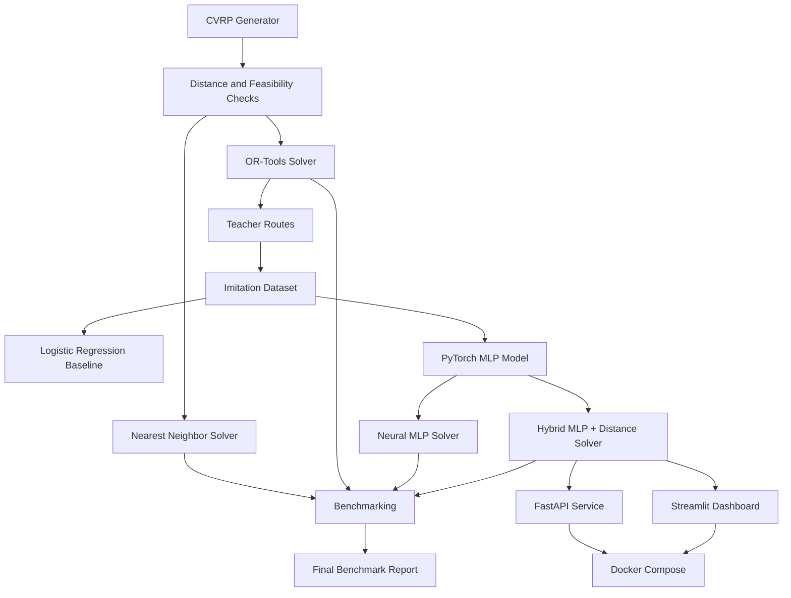

# OptiRouteAI

OptiRouteAI is a machine learning and optimization project for the **Capacitated Vehicle Routing Problem (CVRP)**.

The project compares classical routing methods, Google OR-Tools, imitation learning, a PyTorch MLP model, and a hybrid neural-distance solver.

The main goal is to test whether a learned model can improve a simple routing heuristic while staying faster than OR-Tools.

---

## Key Result

The best non-OR-Tools solver is the **Hybrid MLP solver with alpha = 0.5**.

| Solver | Avg Gap vs OR-Tools | Median Gap vs OR-Tools | Feasibility |
|---|---:|---:|---:|
| Nearest Neighbor | 28.76% | 28.17% | 100% |
| Neural MLP | 29.52% | 28.78% | 100% |
| Hybrid MLP alpha=0.5 | 25.27% | 22.45% | 100% |
| OR-Tools | 0.00% | 0.00% | 100% |

The hybrid solver reduced the average optimality gap from **28.76%** to **25.27%**, giving around **12% relative improvement** over the nearest-neighbor baseline.

---

## System Architecture



---

## What This Project Includes

- Synthetic CVRP instance generation
- Distance and feasibility validation
- Capacity-aware nearest-neighbor solver
- Google OR-Tools CVRP solver
- OR-Tools-based imitation learning dataset
- Logistic regression baseline
- PyTorch MLP imitation model
- Neural MLP route solver
- Hybrid neural-distance solver
- Batch benchmarking
- Final benchmark report generation
- FastAPI solver service
- Streamlit dashboard
- Docker Compose deployment
- Pytest test suite

---

## Machine Learning Approach

OR-Tools is used as the teacher solver.

Each OR-Tools route is converted into candidate-level training examples:

```text
current route state + candidate customer features → selected / not selected
```

The MLP learns to score candidate customers during route construction.

The hybrid solver combines the MLP score with a distance-based score:

```text
final_score = alpha × MLP_score + (1 - alpha) × distance_score
```

Best setting:

```text
alpha = 0.5
```

---

## Model Performance

### PyTorch MLP Imitation Model

| Metric | Value |
|---|---:|
| Accuracy | 84.00% |
| ROC AUC | 94.63% |
| Average Precision | 59.85% |
| Decision Top-1 Accuracy | 73.00% |

The model selected the same next customer as OR-Tools in around **73%** of routing decision steps.

---

## Final Benchmark

| Solver | Avg Distance | Avg Runtime | Feasibility | Avg Gap vs OR-Tools |
|---|---:|---:|---:|---:|
| Nearest Neighbor | 7.4165 | ~0.001s | 100% | 28.76% |
| Neural MLP | 7.4538 | ~0.09s | 100% | 29.52% |
| Hybrid MLP alpha=0.5 | 7.2150 | ~0.09s | 100% | 25.27% |
| OR-Tools | 5.7784 | ~1.00s | 100% | 0.00% |

---

## Project Structure

```text
optirouteai/
├── app/                    # Streamlit dashboard
├── configs/                # Configuration files
├── data/                   # Raw, processed, generated data
├── models/                 # Saved ML models
├── reports/                # Benchmark reports and figures
├── scripts/                # Experiment scripts
├── src/optirouteai/        # Main source code
│   ├── api/                # FastAPI service
│   ├── data/               # Data generation and imitation dataset
│   ├── evaluation/         # Benchmarking and reports
│   ├── models/             # PyTorch model definitions
│   ├── optimization/       # Solvers
│   ├── training/           # Model training
│   ├── utils/              # Feature engineering
│   └── visualization/      # Route plotting
├── tests/                  # Unit tests
├── Dockerfile
├── docker-compose.yml
├── requirements.txt
└── README.md
```

---

## Installation

```powershell
git clone https://github.com/JosephAnggono/optirouteai.git
cd optirouteai
python -m venv .venv
.venv\Scripts\activate
pip install -r requirements.txt
```

Set Python path:

```powershell
$env:PYTHONPATH="src"
```

Run tests:

```powershell
pytest
```

---

## Run FastAPI

```powershell
$env:PYTHONPATH="src"
uvicorn optirouteai.api.main:app --reload
```

Open:

```text
http://localhost:8000/docs
```

Health check:

```text
http://localhost:8000/health
```

---

## Run Streamlit Dashboard

```powershell
$env:PYTHONPATH="src"
streamlit run app\streamlit_dashboard.py
```

Open:

```text
http://localhost:8501
```

---

## Run with Docker

```powershell
docker compose up --build
```

Open:

```text
http://localhost:8000/docs
http://localhost:8501
```

Stop containers:

```powershell
docker compose down
```

---

## API Endpoints

| Endpoint | Description |
|---|---|
| `GET /health` | Check API status |
| `POST /solve` | Solve one generated CVRP instance |
| `POST /compare` | Compare solvers on the same instance |

Example `/solve` request:

```json
{
  "num_customers": 25,
  "num_vehicles": 5,
  "vehicle_capacity": 45,
  "demand_min": 1,
  "demand_max": 8,
  "seed": 42,
  "solver": "hybrid_mlp",
  "alpha": 0.5,
  "ortools_time_limit_seconds": 1
}
```

Available solvers:

```text
nearest_neighbor
ortools
neural_mlp
hybrid_mlp
```

---

## Main Scripts

Generate imitation dataset:

```powershell
python scripts\run_step7_generate_imitation_dataset.py
```

Train logistic regression baseline:

```powershell
python scripts\run_step8_train_model.py
```

Train PyTorch MLP:

```powershell
python scripts\run_step9_train_mlp.py
```

Benchmark neural solver:

```powershell
python scripts\run_step10_neural_solver_benchmark.py
```

Benchmark hybrid solver:

```powershell
python scripts\run_step11_hybrid_solver_benchmark.py
```

Generate final report:

```powershell
python scripts\run_step13_final_report.py
```

---

## Tech Stack

- Python
- NumPy
- Pandas
- Matplotlib
- Scikit-learn
- PyTorch
- Google OR-Tools
- FastAPI
- Streamlit
- Docker
- Pytest
